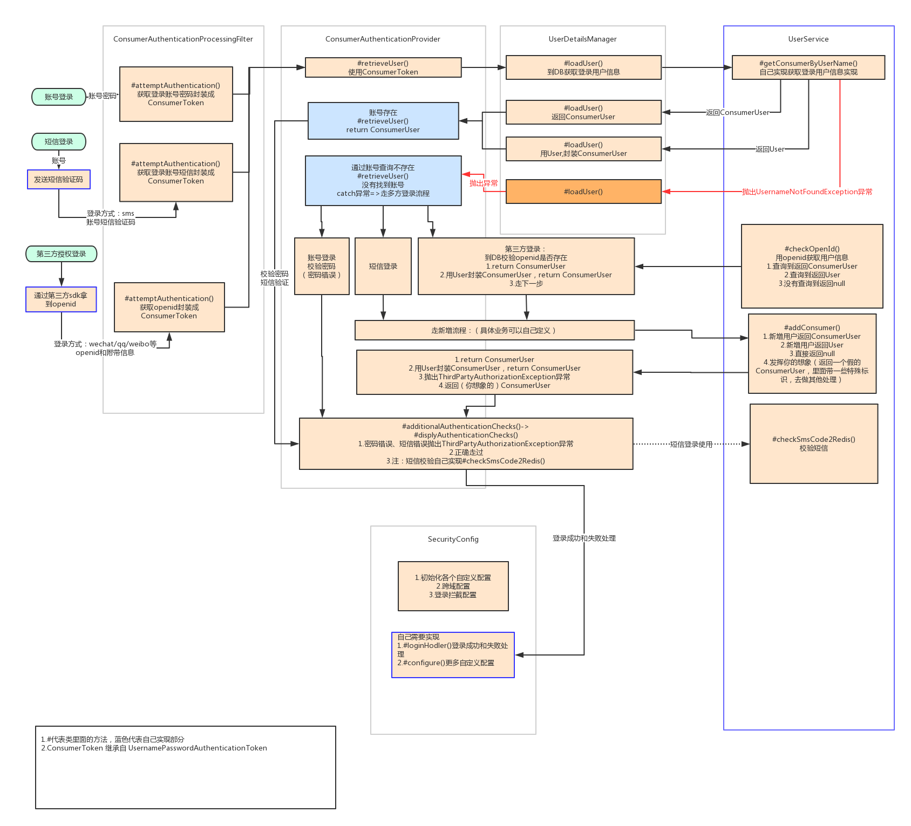
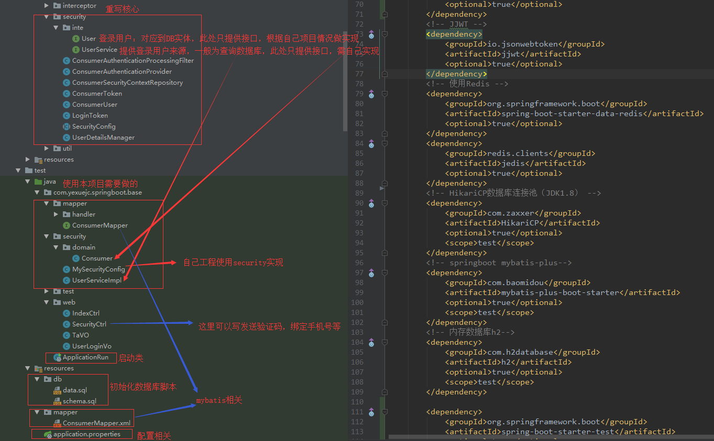
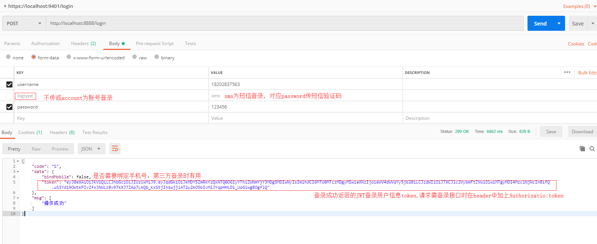
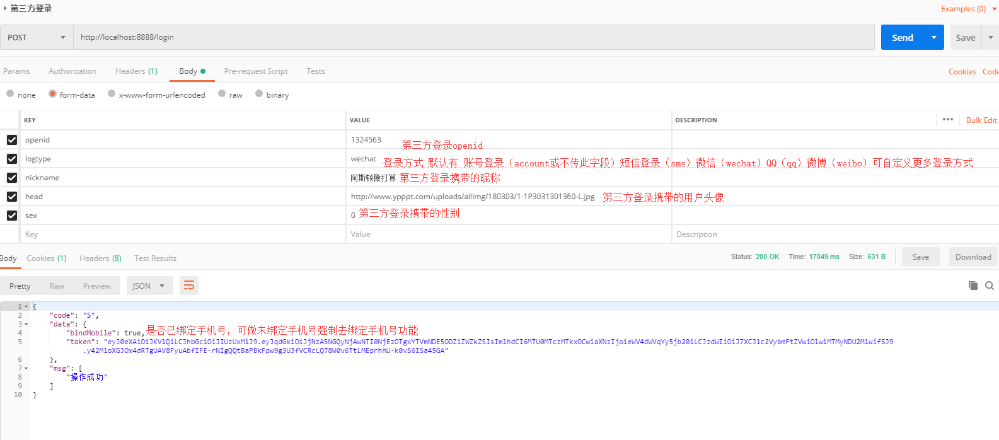

Security框架封装集成多方登录 使用指南
-------------
#### 先上[效果图](Securtity效果图.md)

单独使用例子工程：[https://github.com/yexuejc/springboot-security-login-simple](https://github.com/yexuejc/springboot-security-login-simple)
* 本项目依赖不向下传递

> **引入依赖 pom.xml**

```mxml
 <dependencies>
     <!-- Spring Security -->
     <dependency>
         <groupId>org.springframework.boot</groupId>
         <artifactId>spring-boot-starter-security</artifactId>
     </dependency>
 </dependencies>
```
> **相关文件说明** 所有核心文件都在 com.yexuejc.springboot.base.security 包下
#### 现附上系统实现逻辑图


1.com.yexuejc.springboot.base.security.SecurityConfig
<br/>
**Security 核心，本文件并未启动Security，需继承；然后继承类上加上@EnableWebSecurity注解就启动Security了。**

* 实现loadUserByUsername()方法；自定义逻辑处理登录账号，返回登录账号相关信息
* 实现loginHodler()方法；自定义处理登录成功filter.setAuthenticationSuccessHandler()和失败filter.setAuthenticationFailureHandler()的处理
* 继承configure(HttpSecurity http) 完善更多security过滤配置
* 例子[com.yexuejc.springboot.base.security.MySecurityConfig](../yexuejc-springboot-base/src/test/java/com/yexuejc/springboot/base/security/MySecurityConfig.java)

#### 注： 代码中抛出的相关异常拦截在filter.setAuthenticationFailureHandler()中处理，参考[MySecurityConfig](../yexuejc-springboot-base/src/test/java/com/yexuejc/springboot/base/security/MySecurityConfig.java)
```
filter.setAuthenticationFailureHandler((request, response, exception) -> {
            response.setContentType("application/json;charset=UTF-8");
            response.setStatus(HttpStatus.UNAUTHORIZED.value());
            Resps resps = new Resps();
            if (exception instanceof DisabledException) {
                resps.setErr(RespsConsts.CODE_FAIL, new String[]{BizConsts.BASE_IS_LOCK_MSG});
            } else if (exception instanceof AccountExpiredException) {
                resps.setErr(RespsConsts.CODE_FAIL, new String[]{BizConsts.BASE_IS_EXPIRE_MSG});
            } else if (exception instanceof CredentialsExpiredException) {
                resps.setErr(BizConsts.BASE_LOGIN_IS_EXPIRE_CODE, new String[]{BizConsts.BASE_LOGIN_IS_EXPIRE_MSG});
            } else if (exception instanceof LockedException) {
                resps.setErr(RespsConsts.CODE_FAIL, new String[]{BizConsts.BASE_IS_LOCKED_MSG});
            } else if (exception instanceof AuthenticationCredentialsNotFoundException) {
                resps.setErr(RespsConsts.CODE_FAIL, new String[]{BizConsts.BASE_CREDENTIALS_NOT_FOUND_MSG});
            } else if (exception instanceof ThirdPartyAuthorizationException) {
                resps.setErr(RespsConsts.CODE_FAIL, new String[]{exception.getMessage()});
            } else if (exception instanceof BadCredentialsException) {
                resps.setErr(RespsConsts.CODE_FAIL, new String[]{BizConsts.BASE_PWD_IS_ERR_MSG});
            } else if (exception instanceof UsernameNotFoundException) {
                resps.setErr(RespsConsts.CODE_FAIL, new String[]{BizConsts.BASE_ACCOUNT_NOT_FOUND_MSG});
            } else if (exception instanceof UserNotAuthoriayException) {
                resps.setErr(RespsConsts.CODE_FAIL, new String[]{exception.getMessage()});
            } else {
                resps.setErr(RespsConsts.CODE_FAIL, new String[]{BizConsts.BASE_SYS_ERR_MSG});
            }
            response.getWriter().write(JsonUtil.obj2Json(resps));
            response.getWriter().close();
        });
```

2.com.yexuejc.springboot.base.security.UserDetailsManager
<br/>
**获取登录用户信息**
* 需要实现com.yexuejc.springboot.base.security.inte.UserService
* 例子[com.yexuejc.springboot.base.security.UserServiceImpl](../yexuejc-springboot-base/src/test/java/com/yexuejc/springboot/base/security/UserServiceImpl.java)

3.com.yexuejc.springboot.base.security.LoginToken
<br/>
**登录成功封装至JWT的登录用户信息**


4.com.yexuejc.springboot.base.security.ConsumerUser
<br/>
**登录成功封装至redis的登录用户信息**

5.com.yexuejc.springboot.base.security.ConsumerToken
<br/>
**登录请求时(/login)用户登录参数信息**

6.com.yexuejc.springboot.base.security.ConsumerSecurityContextRepository
<br/>
**登录校验token正确性，返回登录用户（从redis中获取）**

7.com.yexuejc.springboot.base.security.ConsumerAuthenticationProvider
<br/>
**登录时账号校验（原为密码校验，重写之后增加校验短信验证码，第三方openid）**

8.com.yexuejc.springboot.base.security.ConsumerAuthenticationProcessingFilter
<br/>
**重写登录拦截，集成多种登录方式到/login**

> **使用example**

1. 下载本项目至本地，找到yexuejc/yexuejc-springboot/yexuejc-springboot-base/src/test/java/com/yexuejc/springboot/base/ApplicationRun.java
至接run
2. 测试环境配置如下(测试运行环境都在test下面)<br/>
2.1  pom.xml<br/>
* mybatis-plus数据库框架
* HikariCP数据库连接池
* 本地数据库H2
* JJWT作为登录凭证token
* redis 存储登录用户信息
> 关于这些相关框架、工具不做详解，有兴趣可以去学习，这些都可以用你自己熟悉的替换
```
<!-- JJWT -->
<dependency>
    <groupId>io.jsonwebtoken</groupId>
    <artifactId>jjwt</artifactId>
    <optional>true</optional>
</dependency>
<!-- 使用Redis -->
<dependency>
    <groupId>org.springframework.boot</groupId>
    <artifactId>spring-boot-starter-data-redis</artifactId>
    <optional>true</optional>
</dependency>
<dependency>
    <groupId>redis.clients</groupId>
    <artifactId>jedis</artifactId>
    <optional>true</optional>
</dependency>
<!-- HikariCP数据库连接池（JDK1.8） -->
<dependency>
    <groupId>com.zaxxer</groupId>
    <artifactId>HikariCP</artifactId>
    <optional>true</optional>
    <scope>test</scope>
</dependency>
<!-- springboot mybatis-plus-->
<dependency>
    <groupId>com.baomidou</groupId>
    <artifactId>mybatis-plus-boot-starter</artifactId>
    <optional>true</optional>
    <scope>test</scope>
</dependency>
<!-- 内存数据库h2-->
<dependency>
    <groupId>com.h2database</groupId>
    <artifactId>h2</artifactId>
    <optional>true</optional>
    <scope>test</scope>
</dependency>
```

2.2 对应的application.properties<br/>
* redis 0库存储登录用户信息，1库存储短信验证码
* H2数据库 创建数据库表 consumer(用户表) [schema.sql](../yexuejc-springboot-base/src/test/resources/db/schema.sql)；
增加一条用户数据[data.sql](../yexuejc-springboot-base/src/test/resources/db/data.sql)
<br/>启动项目后会自动运行这两个脚本，自此H2数据库中就会有一条用户数据，测试时可以用来登录
<br/>PS:项目运行成功后可以访问 http://localhost:8888/h2-console 登录到数据库

* mybatis-plus 详情[http://mp.baomidou.com/](http://mp.baomidou.com/)

```
#========================================================================================================================
# security相关
#reids
#开启指定redis库db0默认开启
yexuejc.redis.db1=true
spring.redis.jedis.pool.max-active=100
spring.redis.jedis.pool.max-idle=10
spring.redis.jedis.pool.min-idle=3
spring.redis.host=121.42.165.89
spring.redis.password=
spring.redis.port=16379


#db

spring.h2.console.path=/h2-console
spring.h2.console.enabled=true
spring.h2.console.settings.web-allow-others=true
spring.datasource.username=sa
spring.datasource.password=123456
spring.datasource.url=jdbc:h2:mem:test;MODE=PostgreSQL
spring.datasource.driver-class-name=org.h2.Driver
spring.datasource.schema=classpath:db/schema.sql
spring.datasource.data=classpath:db/data.sql

#========================================================================================================================
#mybatis-plus
mybatis-plus.mapper-locations=classpath*:mapper/*.xml
#实体扫描，多个package用逗号或者分号分隔
mybatis-plus.type-aliases-package=com.yexuejc.springboot.base.security.domain
#主键类型0:"数据库ID自增", 1:"用户输入ID",2:"该类型为未设置主键类型", 3:"全局唯一ID UUID",4:全局唯一ID (UUID),5:字符串全局唯一ID (idWorker 的字符串表示);
mybatis-plus.global-config.db-config.id-type=uuid
mybatis-plus.global-config.db-config.db-type=POSTGRE_SQL
#字段策略 0:"忽略判断",1:"非 NULL 判断"),2:"非空判断"
mybatis-plus.global-config.db-config.field-strategy=not_empty
#驼峰下划线转换
mybatis-plus.global-config.db-config.column-underline=true
#逻辑删除配置（下面3个配置）
mybatis-plus.global-config.db-config.logic-delete-value=true
mybatis-plus.global-config.db-config.logic-not-delete-value=false
#配置返回数据库(column下划线命名&&返回java实体是驼峰命名)，自动匹配无需as（没开启这个，SQL需要写as： select user_id as userId）
mybatis-plus.configuration.map-underscore-to-camel-case=true
mybatis-plus.configuration.cache-enabled=false
#========================================================================================================================
```
> 附图


<br>

<br>

